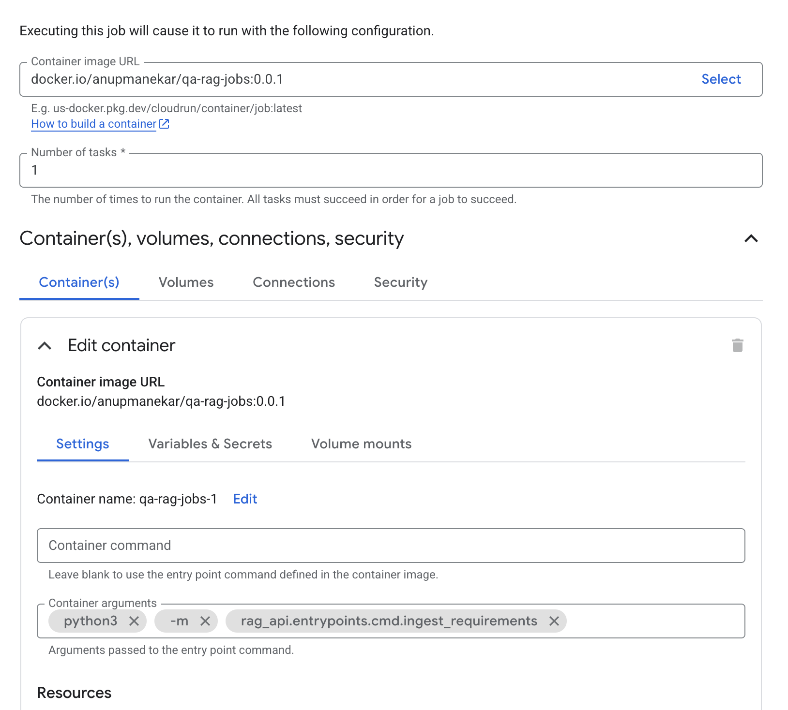

# RAG-based Jira Ticket Query Application

This application is designed to provide responses to any queries regarding tickets in Jira using Retrieval Augmented Generation (RAG). The application utilizes the following technology stack:

- **Python**: Primary backend language
- **Langchain**: Framework for LLM Orchestration
- **LLM Provider**: FireworksAI
- **Vector DB**: MongoDB
- **Operational DB**: MongoDB
- **Monitoring & Observability**: Langsmith

## Features

- Connects with Jira and converts ticket information into embeddings.
- Stores embeddings in MongoDB as a vector database.
- Searches embeddings with cosine similarity of 80%.
- Summarizes the top 5 search results.
- Exposes search query functionality through an API.
- Provides a Next.js based front end with chat functionality to integrate with the API.

## Setup Instructions

### Firestore
1. Setup Firestore (default) collection in GCP Firestore
2. Create a collection named "user_requirements"
3. Create Vector index on Firestore with 768 dimension
    ```
    gcloud firestore indexes composite create \
    --collection-group=user_requirements \
    --query-scope=COLLECTION \
    --field-config=order=ASCENDING,field-path="color" \
    --field-config field-path=vector-field,vector-config='{"dimension":"768", "flat": "{}"}' \
    --database=default
    ```

### Jobs

1. Build docker image
    ```
    docker build -t <image_name> -f ./backend/Dockerfile.jobs ./backend
    ```
2. Push docker to hub
    ```
    docker push <image_name>
    ```
3. Deploy to GCP Cloud Run Jobs

    

4. Ensure that service account is attached to your Cloud Run Job

### Backend Services

1. Build backend services
    ```
    docker build --platform linux/amd64 -t <image_name> ./backend
    ```
2. Run them locally
    ```
    docker run -p 8080:8080 <image_name>
    ```
3. Deploy on GCP Cloud Run Services


### Frontend

1. Set up a Next.js project:
    ```sh
    npx create-next-app@latest
    ```

2. Create a chat interface where users can enter their queries.

3. Integrate the chat interface with the backend API to send user queries and display the summarized results.

4. Run the Next.js application:
    ```sh
    npm run dev
    ```

## Running the Application

1. Start the backend FastAPI application:
    ```sh
    uvicorn backend.app:app --reload
    ```

2. Start the frontend Next.js application:
    ```sh
    npm run dev
    ```

3. Start the Prometheus server for monitoring:
    ```sh
    python monitoring/observability.py
    ```

## Monitoring and Observability

1. Integrate Langsmith for monitoring and observability of the application.

2. Set up logging and error handling to track the performance and issues in the application.

3. Implement metrics and dashboards to monitor the health and usage of the application.

4. Start the Prometheus server for monitoring:
    ```sh
    python monitoring/observability.py
    ```

## Ingestion Endpoint

### Ingest Tickets

The application provides an endpoint to ingest current tickets as embeddings into the vector database. The ingestion is based on the following parameters:

- **ProjectKey**: The key of the Jira project.
- **MaxTickets**: The maximum number of tickets to ingest.
- **IngestionType**: The type of ingestion (Full/Delta).

#### Endpoint

`POST /ingest`

#### Request Body

```json
{
  "ProjectKey": "string",
  "MaxTickets": 10,
  "IngestionType": "Full"
}
```

#### Response

```json
{
  "message": "Ingestion successful"
}
```

### Example

To ingest tickets from a Jira project with the key "PROJ", with a maximum of 10 tickets, and using full ingestion:

```sh
curl -X POST "http://localhost:8000/ingest" -H "Content-Type: application/json" -d '{"ProjectKey": "PROJ", "MaxTickets": 10, "IngestionType": "Full"}'
```

## Swagger Documentation

The application provides Swagger documentation for the supported APIs. You can access the Swagger UI at the following URL:

```
http://localhost:8000/docs
```

This documentation provides a user-friendly interface to explore and test the available API endpoints.
